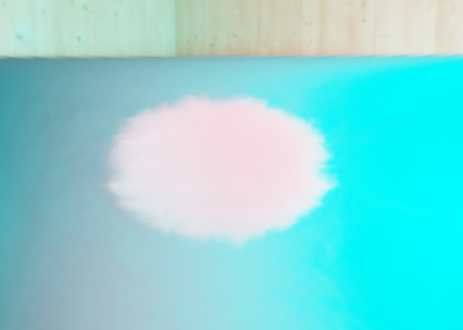
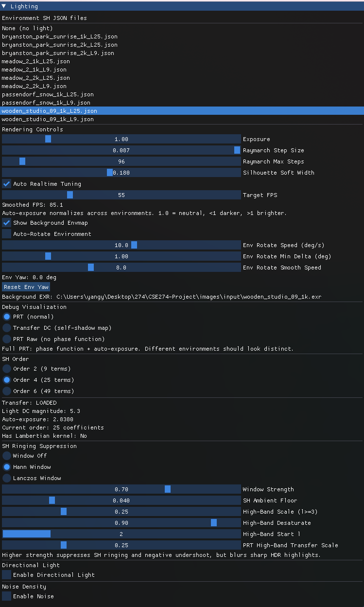

# Milestone 2: Volumetric Self-Transfer for Real-Time Relighting

**Project:** Volumetric Precomputed Radiance Transfer (PRT)  
**Date:** February 2026

---

## 1. Progress Since Milestone 1

At Milestone 1: ray marching with an ellipsoid SDF and Beer–Lambert attenuation, image-based lighting via second-order spherical harmonics (9 coefficients) from HDR environment maps, volumetric self-transfer on a 64³ voxel grid with 512 directions, the PRT formula with Lambertian kernel un-baking in the shader, runtime ImGui environment switching, and debug modes (Transfer DC, PRT Raw). The details of that baseline are documented in the Milestone 1 report. (https://heziq.github.io/CSE274-Reports/)

Since then, the following enhancements have been completed.

**Directional light.** A directional light has been added, which is decoupled from the SH lighting. The shader performs volumetric shadow marching toward the light and adds a single-scattering contribution with a Henyey–Greenstein phase function. ImGui controls allow adjustment of the light direction, color, intensity, shadow step size and max steps, and the phase anisotropy parameter *g*.

**Higher SH orders.** The pipeline now supports Spherical Harmonics order 4 (25 coefficients) and order 6 (49 coefficients) in addition to order 2 (9 coefficients). Both the Python projection and precompute scripts and the C++/GLSL runtime support these orders. High-order transfer data is stored in RGBA 3D textures. For order 2, the lighting coefficients retain the Lambertian kernel; for orders 4 and 6, raw *L**ℓm* coefficients are stored and used directly in the PRT dot product.

**3D noise density.** FBM-style 3D noise is generated and used to modulate the cloud density. The same noise texture and the same ellipsoid-local coordinates are used in both the Python precompute and the runtime shader so that transport and rendering stay consistent. A soft boundary mask is applied at the ellipsoid edge. ImGui exposes controls for noise amplitude, frequency, octaves, lacunarity, persistence, and soft boundary width. The comparison below shows the cloud without noise (smooth, uniform density) and with noise (cloud-like structure and fine variation).

  
  

  <em>Left: without noise (smooth ellipsoid). Right: with 3D noise density (cloud-like structure).</em>

**HDR sky rotation.** An optional auto-rotate mode rotates the HDR environment around the vertical (Y) axis in real time. The SH lighting coefficients are rotated on the CPU each frame and uploaded to the shader; the background EXR is rotated by the same yaw. This demonstrates that cloud relighting responds dynamically to the environment and is not static. Video demo in next part. 

**SH ringing control.** Optional Hann or Lanczos windowing can be applied to the SH lighting coefficients to reduce ringing. Additional controls include an ambient floor, high-band scale and desaturation, and a PRT high-band transfer scale to dampen the contribution of higher SH bands in the transfer.

---

## 2. Current Capabilities

  

The system renders a real-time volumetric cloud with PRT self-shadowing under HDR environment maps. The user can switch at runtime between any SH lighting JSON file and between SH orders 9, 25, and 49, with matching transfer data loaded automatically. Directional light adds sharp volumetric shadows and is controlled independently. Noise-modulated density (and optional noisy transfer) gives cloud-like structure while keeping the same density model in precompute and runtime. The background environment EXR can be displayed and optionally auto-rotated to match the SH lighting rotation. Debug modes (PRT normal, Transfer DC, PRT raw) and auto-exposure (normalizing by the DC magnitude of the lighting) remain available.

---

## 3. Video Demo

Two video demos of the current cloud renderer are provided. Both use **SH order 4** (25 coefficients). The first shows the cloud with the background environment visible to mimic a realistic use case; the second shows the cloud without the background so that relighting and self-shadowing can be compared more clearly.

### With background (realistic case)

The video below shows the volumetric cloud with the HDR environment map displayed as the background. The environment can be rotated in real time so that both the visible sky and the cloud lighting change together.

<video src="video/with_background.mp4" controls width="640"></video>

**Video file:** [video/with_background.mp4](video/with_background.mp4)

### Without background (clearer comparison)

The video below shows the same cloud with the background disabled. This view makes it easier to compare how the cloud responds to different lighting directions and to see the self-shadowing (darker interior, brighter edges) without the sky image behind it.

<video src="video/withou_background.mp4" controls width="640"></video>

**Video file:** [video/withou_background.mp4](video/withou_background.mp4)

---

## 4. Next Steps (Experiments)

Planned next steps include comparing rendering with and without self-transfer (normal-based SH versus full PRT), trying different SH orders (9, 25, 49) and documenting quality versus cost, testing different voxel resolutions (e.g. 32³ vs 64³) if support is added, testing multiple HDR environments (directional versus diffuse) and documenting failure cases such as high-frequency detail lost at low SH order, and measuring frame rate and precomputation time to summarize tradeoffs.
